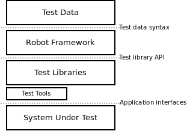
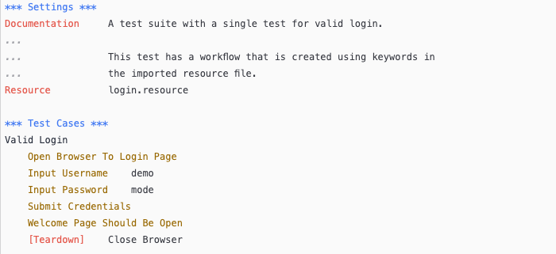
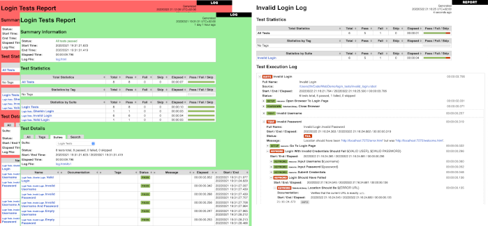

# Introduction

Robot Framework is a Python-based, extensible keyword-driven automation
framework for acceptance testing, acceptance test driven development (ATDD),
behavior driven development (BDD) and robotic process automation (RPA). It
can be used in distributed, heterogeneous environments, where automation
requires using different technologies and interfaces.

The framework has a rich ecosystem around it consisting of various generic
libraries and tools that are developed as separate projects. For more
information about Robot Framework and the ecosystem, see
https://robotframework.org.

Robot Framework is open source software released under the [Apache License
2.0](#apache-license-20). Its development is sponsored by the [Robot Framework Foundation](https://robotframework.org/foundation).

!!! note
    The official RPA support was added in Robot Framework 3.1.
    This User Guide still talks mainly about creating tests, test data,
    and test libraries, but same concepts apply also when [creating
    tasks](../creating-test-data/creating-tasks.md#creating-tasks).

## Why Robot Framework?

- Enables easy-to-use tabular syntax for [creating test cases](../creating-test-data/creating-test-cases.md#creating-test-cases) in a uniform
  way.

- Provides ability to create reusable [higher-level keywords](../creating-test-data/creating-user-keywords.md#creating-user-keywords) from the
  existing keywords.

- Provides easy-to-read result [reports](../executing-tests/post-processing.md#creating-reports-logs-and-output-files) and [logs](../executing-tests/execution-artifacts.md#splitting-logs) in HTML format.

- Is platform and application independent.

- Provides a simple [library API](../extending/creating-test-libraries.md#creating-test-libraries) for creating customized test libraries
  which can be implemented natively with Python.

- Provides a [command line interface](../executing-tests/basic-usage.md#executing-test-cases) and XML based [output files](../executing-tests/result-files.md#output-file)  for
  integration into existing build infrastructure (continuous integration
  systems).

- Provides support for testing web applications, rest APIs, mobile applications,
  running processes, connecting to remote systems via Telnet or SSH, and so on.

- Supports creating [data-driven test cases](../creating-test-data/creating-test-cases.md#data-driven-style).

- Has built-in support for [variables](../creating-test-data/variables.md#variables), practical particularly for testing in
  different environments.

- Provides [tagging](../creating-test-data/creating-test-cases.md#tagging-test-cases) to categorize and [select test cases](../executing-tests/configuring-execution.md#selecting-test-cases) to be executed.

- Enables easy integration with source control: [test suites](../creating-test-data/creating-test-suites.md#creating-test-suites) are just files
  and directories that can be versioned with the production code.

- Provides [test-case](../creating-test-data/creating-test-cases.md#test-setup-and-teardown) and [test-suite](../creating-test-data/creating-test-suites.md#suite-setup-and-teardown) -level setup and teardown.

- The modular architecture supports creating tests even for applications with
  several diverse interfaces.

## High-level architecture

Robot Framework is a generic, application and technology independent
framework. It has a highly modular architecture illustrated in the
diagram below.

*Robot Framework architecture*

The [test data](#creating-test-data) is in simple, easy-to-edit tabular format. When
Robot Framework is started, it processes the data, [executes test
cases](../executing-tests/basic-usage.md#executing-test-cases) and generates logs and reports. The core framework does not
know anything about the target under test, and the interaction with it
is handled by [libraries](../extending/creating-test-libraries.md#creating-test-libraries). Libraries can either use application
interfaces directly or use lower level test tools as drivers.

## Screenshots

Following screenshots show examples of the [test data](#creating-test-data) and created
[reports](../executing-tests/post-processing.md#creating-reports-logs-and-output-files) and [logs](../executing-tests/execution-artifacts.md#splitting-logs).

*Test case file*

*Reports and logs*

## Getting more information

### Project pages

The number one place where to find more information about Robot Framework
and the rich ecosystem around it is https://robotframework.org.
Robot Framework itself is hosted on [GitHub](https://github.com/robotframework/robotframework).

### Guides

The official [Robot Framework Guides](https://docs.robotframework.org/docs) cover topics like getting started,
using various libraries, IDE configuration, and so on.

### Support forums

The main support forums where to ask questions related to Robot Framework,
announce new releases and just discuss with fellow community members are
[Slack](https://slack.robotframework.org) and [Forum](https://forum.robotframework.org).

