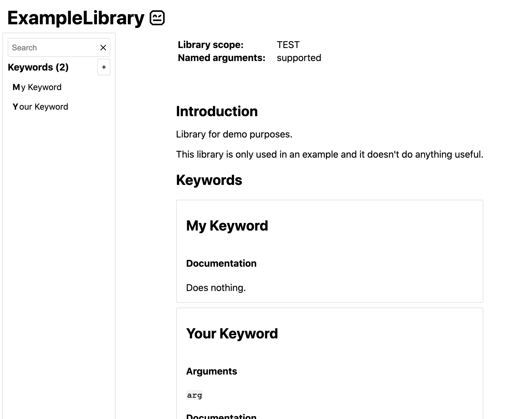

<a id="libdoc"></a>
# Library documentation tool (Libdoc)

Libdoc is Robot Framework's built-in tool that can generate documentation for
Robot Framework libraries and resource files. It can generate HTML documentation
for humans as well as machine readable spec files in XML and JSON formats.
Libdoc also has few special commands to show library or resource information
on the console.

Documentation can be created for:

- libraries implemented using the normal static library [API](https://en.wikipedia.org/wiki/XML_Schema_(W3C)),
- libraries using the [dynamic API](https://json-schema.org/), including remote libraries,
- [resource files](../creating-test-data/resource-files.md#resource-files),
- [suite files](../creating-test-data/creating-test-suites.md#suite-files), and
- [suite initialization files](../creating-test-data/creating-test-suites.md#suite-initialization-files).

Additionally it is possible to use XML and JSON spec files created by Libdoc
earlier as an input.

!!! note
    Support for generating documentation for suite files and suite
    initialization files is new in Robot Framework 6.0.

## General usage

### Synopsis

```
libdoc [options] library_or_resource output_file
libdoc [options] library_or_resource list|show|version [names]
```

### Options

  -f, --format <html|xml|json|libspec>
                           Specifies whether to generate an HTML output for humans or
                           a machine readable spec file in XML or JSON format. The
                           `libspec` format means XML spec with documentations converted
                           to HTML. The default format is got from the output file
                           extension.
  -s, --specdocformat <raw|html>
                           Specifies the documentation format used with XML and JSON
                           spec files. `raw` means preserving the original documentation
                           format and `html` means converting documentation to HTML. The
                           default is `raw` with XML spec files and `html` with JSON
                           specs and when using the special `libspec` format.
  -F, --docformat <robot|html|text|rest>
                           Specifies the source documentation format. Possible
                           values are Robot Framework's documentation format,
                           HTML, plain text, and reStructuredText. Default value
                           can be specified in test library source code and
                           the initial default value is `robot`.
  --theme <dark|light|none>
                           Use dark or light HTML theme. If this option is not used,
                           or the value is `none`, the theme is selected based on
                           the browser color scheme. Only applicable with HTML outputs.
                           New in Robot Framework 6.0.
  --language <lang>
                          Set the default language in documentation. `lang`
                          must be a code of a built-in language, which are
                          `en` and `fi`. New in Robot Framework 7.2.
  -N, --name <newname>     Sets the name of the documented library or resource.
  -V, --version <newversion>  Sets the version of the documented library or
                           resource. The default value for test libraries is
                           [defined in the source code](https://en.wikipedia.org/wiki/XML_Schema_(W3C)).
  -P, --pythonpath <path>  Additional locations where to search for libraries
                           and resources similarly as when [running tests](https://json-schema.org/).
  --quiet                  Do not print the path of the generated output file
                           to the console.
  -h, --help               Prints this help.

### Executing Libdoc

The easiest way to run Libdoc is using the `libdoc` command created as part of
the normal installation:

```
libdoc ExampleLibrary ExampleLibrary.html
```

Alternatively it is possible to execute the `robot.libdoc` module directly.
This approach is especially useful if you have installed Robot Framework using
multiple Python versions and want to use a specific version with Libdoc:

```
python -m robot.libdoc ExampleLibrary ExampleLibrary.html
python3.9 -m robot.libdoc ExampleLibrary ExampleLibrary.html
```

Yet another alternative is running the `robot.libdoc` module as a script:

```
python path/to/robot/libdoc.py ExampleLibrary ExampleLibrary.html
```

!!! note
    The separate `libdoc` command is new in Robot Framework 4.0.

### Specifying library or resource file

#### Python libraries and dynamic libraries with name or path

When documenting libraries implemented with Python or that use the
[dynamic library API](../extending/creating-test-libraries.md#dynamic-library-api), it is possible to specify the library either by
using just the library name or path to the library source code:

```
libdoc ExampleLibrary ExampleLibrary.html
libdoc src/ExampleLibrary.py docs/ExampleLibrary.html
```

In the former case the library is searched using the [module search path](../executing-tests/configuring-execution.md#module-search-path)
and its name must be in the same format as when [importing libraries](../creating-test-data/using-test-libraries.md#importing-libraries) in
Robot Framework test data.

If these libraries require arguments when they are imported, the arguments
must be catenated with the library name or path using two colons like
`MyLibrary::arg1::arg2`. If arguments change what keywords the library
provides or otherwise alter its documentation, it might be a good idea to use
`--name` option to also change the library name accordingly.

#### Resource files with path

Resource files must always be specified using a path:

```
libdoc example.resource example.html
```

If the path does not exist, resource files are also searched from all directories
in the [module search path](../executing-tests/configuring-execution.md#module-search-path) similarly as when executing test cases.

#### Libdoc spec files

Earlier generated Libdoc XML or JSON spec files can also be used as inputs.
This works if spec files use either **.xml*, **.libspec* or
**.json* extension:

```
libdoc Example.xml Example.html
libdoc Example.libspec Example.html
libdoc Example.json Example.html
```

!!! note
    Support for the **.libspec* extension is new in
    Robot Framework 3.2.

!!! note
    Support for the **.json* extension is new in
    Robot Framework 4.0.

### Generating documentation

Libdoc can generate documentation in HTML (for humans) and XML or JSON (for tools)
formats. The file where to write the documentation is specified as the second
argument after the library/resource name or path, and the output format is
got from the output file extension by default.

#### Libdoc HTML documentation

Most Robot Framework libraries use Libdoc to generate library documentation
in HTML format. This format is thus familiar for most people who have used
Robot Framework. A simple example can be seen below, and it has been generated
based on the example found a [bit later in this section](https://en.wikipedia.org/wiki/XML_Schema_(W3C)).



*The HTML documentation starts with general library introduction, continues*

with a section about configuring the library when it is imported (when
applicable), and finally has shortcuts to all keywords and the keywords
themselves. The magnifying glass icon on the lower right corner opens the
keyword search dialog that can also be opened by simply pressing the `s` key.

Libdoc automatically creates HTML documentation if the output file extension
is **.html*. If there is a need to use some other extension, the
format can be specified explicitly with the `--format` option.

Starting from Robot Framework 7.2, it is possible to localise the static
texts in the HTML documentation by using the `--language` option.

See the `README.rst` file in `src/web/libodc` directory in the project
repository for up to date information about how to add new languages
for the localisation.

```
libdoc OperatingSystem OperatingSystem.html
libdoc --name MyLibrary Remote::http://10.0.0.42:8270 MyLibrary.html
libdoc --format HTML test/resource.robot doc/resource.htm
```

#### Libdoc XML spec files

Libdoc can also generate documentation in XML format that is suitable for
external tools such as editors. It contains all the same information as
the HTML format but in a machine readable format.

XML spec files also contain library and keyword source information so that
the library and each keyword can have source path (`source` attribute) and
line number (`lineno` attribute). The source path is relative to the directory
where the spec file is generated thus does not refer to a correct file if
the spec is moved. The source path is omitted with keywords if it is
the same as with the library, and both the source path and the line number
are omitted if getting them from the library fails for whatever reason.

Libdoc automatically uses the XML format if the output file extension is
**.xml* or **.libspec*. When using the special **.libspec*
extension, Libdoc automatically enables the options `-f XML -s HTML` which means
creating an XML output file where keyword documentation is converted to HTML.
If needed, the format can be explicitly set with the `--format` option.

```
libdoc OperatingSystem OperatingSystem.xml
libdoc test/resource.robot doc/resource.libspec
libdoc --format xml MyLibrary MyLibrary.spec
libdoc --format xml -s html MyLibrary MyLibrary.xml
```

The exact Libdoc spec file format is documented with an [XML schema](https://en.wikipedia.org/wiki/XML_Schema_(W3C)) (XSD)
at https://github.com/robotframework/robotframework/tree/master/doc/schema.
The spec file format may change between Robot Framework major releases.

To make it easier for external tools to know how to parse a certain
spec file, the spec file root element has a dedicated `specversion`
attribute. It was added in Robot Framework 3.2 with value `2` and earlier
spec files can be considered to have version `1`. The spec version will
be incremented in the future if and when changes are made.
Robot Framework 4.0 introduced new spec version `3` which is incompatible
with earlier versions.

!!! note
    The `XML:HTML` format introduced in Robot Framework 3.2. has been
    replaced by the format `LIBSPEC` ot the option combination
    `--format XML --specdocformat HTML`.

!!! note
    Including source information and spec version are new in Robot
    Framework 3.2.

#### Libdoc JSON spec files

Since Robot Framework 4.0 Libdoc can also generate documentation in JSON
format that is suitable for external tools such as editors or web pages.
It contains all the same information as the HTML format but in a machine
readable format.

Similar to XML spec files the JSON spec files contain all information and
can also be used as input to Libdoc. From that format any other output format
can be created. By default the library documentation strings are converted
to HTML format within the JSON output file.

The exact JSON spec file format is documented with an [JSON schema](https://json-schema.org/)
at https://github.com/robotframework/robotframework/tree/master/doc/schema.
The spec file format may change between Robot Framework major releases.

### Viewing information on console

Libdoc has three special commands to show information on the console.
These commands are used instead of the name of the output file, and they can
also take additional arguments.

`list`
: List names of the keywords the library/resource contains. Can be
    limited to show only certain keywords by passing optional patterns
    as arguments. Keyword is listed if its name contains given pattern.
`show`
    Show library/resource documentation. Can be limited to show only
    certain keywords by passing names as arguments. Keyword is shown if
    its name matches any given name. Special argument `intro` will show
    only the library introduction and importing sections.
`version`
    Show library version

Optional patterns given to `list` and `show` are case and space
insensitive. Both also accept `*` and `?` as wildcards.

Examples:

```
libdoc Dialogs list
libdoc SeleniumLibrary list browser
libdoc Remote::10.0.0.42:8270 show
libdoc Dialogs show PauseExecution execute*
libdoc SeleniumLibrary show intro
libdoc SeleniumLibrary version
```

## Writing documentation

This section discusses writing documentation for [Python](https://en.wikipedia.org/wiki/XML_Schema_(W3C)) based test
libraries that use the static library API as well as for [dynamic libraries](#dynamic-libraries)
and [resource files](https://json-schema.org/). [Creating test libraries](../extending/creating-test-libraries.md#creating-test-libraries) and [resource files](../creating-test-data/resource-files.md#resource-files) is
described in more details elsewhere in the User Guide.

### Python libraries

The documentation for Python libraries that use the [static library API](../extending/creating-test-libraries.md#static-library-api)
is written simply as doc strings for the library class or module and for
methods implementing keywords. The first line of the method documentation is
considered as a short documentation for the keyword (used, for example, as
a tool tip in links in the generated HTML documentation), and it should
thus be as describing as possible, but not too long.

The simple example below illustrates how to write the documentation in
general. How the HTML documentation generated based on this example looks
like can be seen [above](http://www.python.org/dev/peps/pep-0257), and there is also a [bit longer example](#python-libraries) at
the end of this chapter.

```python
src/SupportingTools/ExampleLibrary.py
```
!!! tip
    If you library does some initialization work that should not be done
    when using Libdoc, you can [easily detect is Robot Framework running](https://en.wikipedia.org/wiki/XML_Schema_(W3C))

!!! tip
    For more information on Python documentation strings, see [PEP-257](https://json-schema.org/).

### Dynamic libraries

To be able to generate meaningful documentation for dynamic libraries,
the libraries must return keyword argument names and documentation using
`get_keyword_arguments` and `get_keyword_documentation`
methods (or using their camelCase variants `getKeywordArguments`
and `getKeywordDocumentation[). Libraries can also support
general library documentation via special ](http://www.python.org/dev/peps/pep-0257)intro__[ and
](../creating-test-data/variable-files.md#command-line)init__` values to the `get_keyword_documentation[ method.

See the [Dynamic library API](../extending/creating-test-libraries.md#dynamic-library-api) section for more information about how to
create these methods.

### Importing section

A separate section about how the library is imported is created based on its
initialization methods. If the library has an  ](../creating-test-data/control-structures.md#if)init__`
method that takes arguments in addition to `self`, its documentation and
arguments are shown.

```python
class TestLibrary:

    def __init__(self, mode='default')
        """Creates new TestLibrary. `mode` argument is used to determine mode."""
        self.mode = mode

    def some_keyword(self, arg):
        """Does something based on given `arg`.

        What is done depends on the `mode` specified when `importing` the library.
        """
        if self.mode == 'secret':
             # ...
```
### Resource file documentation

Keywords in resource files can have documentation using
`[Documentation]` setting, and this documentation is also used by
Libdoc. First line of the documentation (until the first
[implicit newline](https://en.wikipedia.org/wiki/XML_Schema_(W3C)) or explicit `\n`) is considered to be the short
documentation similarly as with test libraries.

Also the resource file itself can have `Documentation` in the
Setting section for documenting the whole resource file.

Possible variables in resource files can not be documented.

```robotframework
*** Settings ***
Documentation    Resource file for demo purposes.
...              This resource is only used in an example and it doesn't do anything useful.

*** Keywords ***
My Keyword
    [Documentation]   Does nothing
    No Operation

Your Keyword
    [Arguments]  ${arg}
    [Documentation]   Takes one argument and *does nothing* with it.
    ...
    ...    Examples:
    ...    | Your Keyword | xxx |
    ...    | Your Keyword | yyy |
    No Operation
```

## Documentation syntax

Libdoc supports documentation in Robot Framework's own [documentation
syntax](#documentation-syntax), HTML, plain text, and [reStructuredText](https://en.wikipedia.org/wiki/ReStructuredText). The format to use can be
specified in [library source code](https://en.wikipedia.org/wiki/XML_Schema_(W3C)) using `ROBOT_LIBRARY_DOC_FORMAT`
attribute or given from the command line using `--docformat (-F)` option.
In both cases the possible case-insensitive values are `ROBOT` (default),
`HTML`, `TEXT` and `reST`.

Robot Framework's own documentation format is the default and generally
recommended format. Other formats are especially useful when using existing
code with existing documentation in test libraries.

### Robot Framework documentation syntax

Most important features in Robot Framework's [documentation syntax](#documentation-syntax) are
formatting using `*bold*[and](../extending/creating-test-libraries.md#detecting-is-robot-framework-running)italic_`, custom links and
automatic conversion of URLs to links, and the possibility to create tables and
pre-formatted text blocks (useful for examples) simply with pipe character.
If documentation gets longer, support for section titles can also be handy.

Some of the most important formatting features are illustrated in the example
below. Notice that since this is the default format, there is no need to use
`ROBOT_LIBRARY_DOC_FORMAT` attribute nor give the format from the command
line.

```python
"""Example library in Robot Framework format.

- Formatting with *bold* and _italic_.
- URLs like http://example.com are turned to links.
- Custom links like [http://robotframework.org|Robot Framework] are supported.
- Linking to `My Keyword` works.
"""

def my_keyword():
    """Nothing more to see here."""
```
#### Creating table of contents automatically

With bigger libraries it is often useful to add a table of contents to
the library introduction. When using the Robot Framework documentation format,
this can be done automatically by adding a special `%TOC%` marker into a line
on its own. The table of contents is created based on the top-level
[section titles](../appendices/documentation-formatting.md#section-titles) (e.g. `= Section =`) used in the introduction. In addition
to them, the TOC also gets links to the [automatically created sections](https://en.wikipedia.org/wiki/XML_Schema_(W3C))
for shortcuts and keywords as well as for importing and tags sections when
applicable.

```python
"""Example library demonstrating TOC generation.

The %TOC% marker only creates the actual table of contents and possible
header or other explanation needs to be added separately like done below.

== Table of contents ==

%TOC%

= Section title =

The top-level section titles are automatically added to the TOC.

= Second section =

== Sub section ==

Sub section titles are not added to the TOC.
"""

def my_keyword():
    """Nothing more to see here."""
```
!!! note
    Automatic TOC generation is a new feature in Robot Framework 3.2.

### HTML documentation syntax

When using HTML format, you can create documentation pretty much freely using
any syntax. The main drawback is that HTML markup is not that human friendly,
and that can make the documentation in the source code hard to maintain and read.
Documentation in HTML format is used by Libdoc directly without any
transformation or escaping. The special syntax for [linking to keywords](#linking-to-keywords) using
syntax like `\`My Keyword\`` is supported, however.

Example below contains the same formatting examples as the previous example.
Now `ROBOT_LIBRARY_DOC_FORMAT` attribute must be used or format given
on the command line like `--docformat HTML`.

```python
"""Example library in HTML format.

<ul>
  <li>Formatting with <b>bold</b> and <i>italic</i>.
  <li>URLs are not turned to links automatically.
  <li>Custom links like <a href="http://www.w3.org/html">HTML</a> are supported.
  <li>Linking to `My Keyword` works.
</ul>
"""
ROBOT_LIBRARY_DOC_FORMAT = 'HTML'

def my_keyword():
    """Nothing more to see here."""
```
### Plain text documentation syntax

When the plain text format is used, Libdoc uses the documentation as-is.
Newlines and other whitespace are preserved except for indentation, and
HTML special characters (`<>&`) escaped. The only formatting done is
turning URLs into clickable links and supporting [internal linking](#internal-linking)
like `\`My Keyword\``.

```python
"""Example library in plain text format.

- Formatting is not supported.
- URLs like http://example.com are turned to links.
- Custom links are not supported.
- Linking to `My Keyword` works.
"""
ROBOT_LIBRARY_DOC_FORMAT = 'text'

def my_keyword():
    """Nothing more to see here."""
```
### reStructuredText documentation syntax

[reStructuredText](https://en.wikipedia.org/wiki/ReStructuredText) is simple yet powerful markup syntax used widely in Python
projects (including this User Guide) and elsewhere. The main limitation
is that you need to have the [docutils](https://pypi.python.org/pypi/docutils) module installed to be able to generate
documentation using it. Because backtick characters have special meaning in
reStructuredText, [linking to keywords](#linking-to-keywords) requires them to be escaped like
`\\\`My Keyword\\\``.

One of the nice features that reStructured supports is the ability to mark code
blocks that can be syntax highlighted.
Syntax highlight requires additional [Pygments](http://pygments.org/) module and supports all the
languages that Pygments supports.

```python
"""Example library in reStructuredText format.

- Formatting with **bold** and *italic*.
- URLs like http://example.com are turned to links.
- Custom links like reStructuredText__ are supported.
- Linking to \`My Keyword\` works but requires backtics to be escaped.

.. code:: robotframework

    *** Test Cases ***
    Example
        My keyword    # How cool is this!!?!!?!1!!
"""
ROBOT_LIBRARY_DOC_FORMAT = 'reST'

def my_keyword():
    """Nothing more to see here."""
```
<a id="internal-linking"></a>
## Internal linking

Libdoc supports internal linking to keywords and different
sections in the documentation. Linking is done by surrounding the
target name with backtick characters like `\`target\``. Target
names are case-insensitive and possible targets are explained in the
subsequent sections.

There is no error or warning if a link target is not found, but instead Libdoc
just formats the text in italics. Earlier this formatting was recommended to
be used when referring to keyword arguments, but that was problematic because
it could accidentally create internal links. Nowadays it is recommended to
use [inline code style](../appendices/documentation-formatting.md#inline-styles)_ with double backticks like
`\`\`argument\`\`` instead. The old formatting of single backticks
may even be removed in the future in favor of giving an error when a link
target is not found.

In addition to the examples in the following sections, internal linking
and argument formatting is shown also in the [longer example](https://en.wikipedia.org/wiki/XML_Schema_(W3C)) at the
end of this chapter.

### Linking to keywords

All keywords the library have automatically create link targets and they can
be linked using syntax `\`Keyword Name\``. This is illustrated with
the example below where both keywords have links to each others.

```python
def keyword(log_level="INFO"):
    """Does something and logs the output using the given level.

    Valid values for log level` are "INFO" (default) "DEBUG" and "TRACE".

    See also `Another Keyword`.
    """
    # ...

def another_keyword(argument, log_level="INFO"):
    """Does something with the given argument else and logs the output.

    See `Keyword` for information about valid log levels.
    """
    # ...
```
!!! note
    When using [reStructuredText documentation syntax](#restructuredtext-documentation-syntax), backticks must
    be escaped like `\\\`Keyword Name\\\``.

### Linking to automatic sections

The documentation generated by Libdoc always contains sections
for overall library introduction and for
keywords.  If a library itself takes arguments, there is also
separate [importing section](#importing-section). If any of the keywords has [tags](https://en.wikipedia.org/wiki/XML_Schema_(W3C)),
a separate selector for them is also shown in the overview.

All the sections act as targets that can be linked, and the possible
target names are listed in the table below. Using these targets is
shown in the example of the next section.

   | Section | Target |
   | --- | --- |
   | Introduction | `\`introduction\`` and `\`library introduction\`` |
   | Importing | `\`importing\`` and `\`library importing\`` |
   | Keywords | `\`keywords\`` |

!!! note
    Before Robot Framework 4.0 there were also sections for tags and shortcuts.
    In Robot Framework 4.0 these have been removed in favor of the overview menu. This means
    that prior linking to shortcuts or tags sections does not work.

### Linking to custom sections

Robot Framework's [documentation syntax](#documentation-syntax)
supports custom [section titles](../appendices/documentation-formatting.md#section-titles), and the titles used in the
library or resource file introduction automatically create link
targets. The example below illustrates linking both to automatic and
custom sections:

```python
"""Library for Libdoc demonstration purposes.

This library does not do anything useful.

= My section  =

We do have a custom section in the documentation, though.
"""

def keyword():
    """Does nothing.

    See `introduction` for more information and `My section` to test how
    linking to custom sections works.
    """
    pass
```
!!! note
    Linking to custom sections works only when using [Robot Framework
    documentation syntax](#robot-framework-documentation-syntax).

## Representing arguments

Libdoc shows information about keywords' arguments automatically.

### Included information

The following information is shown for all keywords regardless are they implemented
in libraries or in resource files:

- Argument name. User keyword arguments are shown without the `${}` decoration
  to make arguments look the same regardless where keywords originate from.
- Marker telling is the argument [positional-only](https://en.wikipedia.org/wiki/XML_Schema_(W3C)), [named-only](https://json-schema.org/),
  [free positional](http://www.python.org/dev/peps/pep-0257), [free named](../extending/creating-test-libraries.md#varargs-library), or [normal argument](../extending/creating-test-libraries.md#kwargs-library) that can be given
  either by position or by name.
- Possible default value. Shown like `= 42`.
- Possible type. Shown like `<int>`. Can be a link to type documentation as explained
  in the next section.


When referring to arguments in keyword documentation, it is recommended to
use [inline code style](../appendices/documentation-formatting.md#inline-styles)_ like `\`\`argument\`\``.

### Automatically listing type documentation

As mentioned above, Libdoc automatically shows possible type information when
listing arguments. If the type is a custom type based on [Enum](https://docs.python.org/library/enum.html#enum.Enum) or [TypedDict](https://docs.python.org/library/typing.html#typing.TypedDict),
the type is [automatically converted](../extending/creating-test-libraries.md#supported-conversions), or the type has [custom converter](../extending/creating-test-libraries.md#custom-argument-converters),
also the type itself is listed separately to show more information about it.
When these types are used in arguments, the type name also becomes a link
to the type information.

All listed data types show possible type documentation as well as what argument
types are supported. In addition to that, types based on `Enum` list available
members and types based on `TypedDict` show the dictionary structure.

!!! note
    Automatically listing types based on `Enum` and `TypedDict` is new
    in Robot Framework 4.0. Listing other types is new in Robot Framework 5.0.

## Libdoc example

The following example illustrates how to use the most important
[documentation formatting](../appendices/documentation-formatting.md#documentation-formatting) possibilities, [internal linking](#internal-linking), and so
on. [Click here](https://robotframework.org/robotframework/latest/libraries/BuiltIn.html) to see how the generated documentation looks like.

```python
src/SupportingTools/LoggingLibrary.py
```
All [standard libraries](../creating-test-data/using-test-libraries.md#standard-libraries) have documentation generated by
Libdoc and their documentation (and source code) act as a more
realistic examples.

